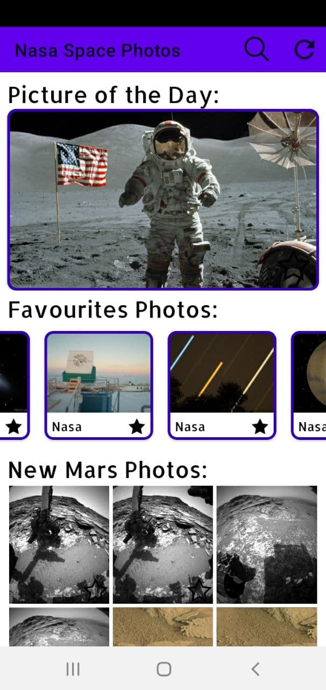
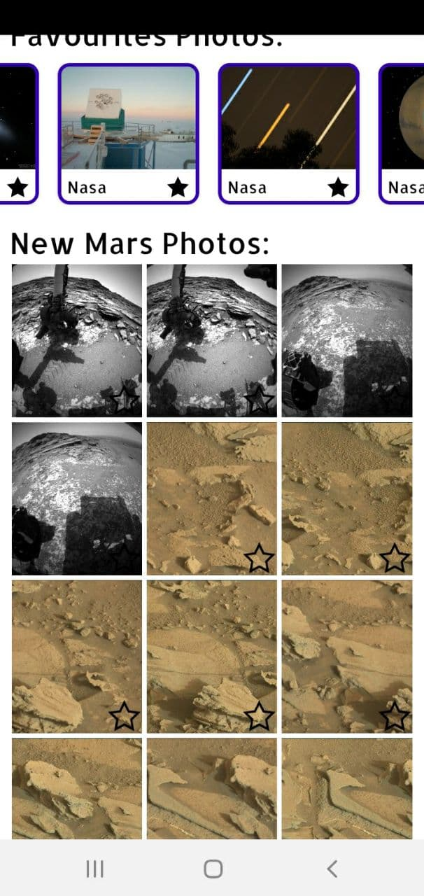
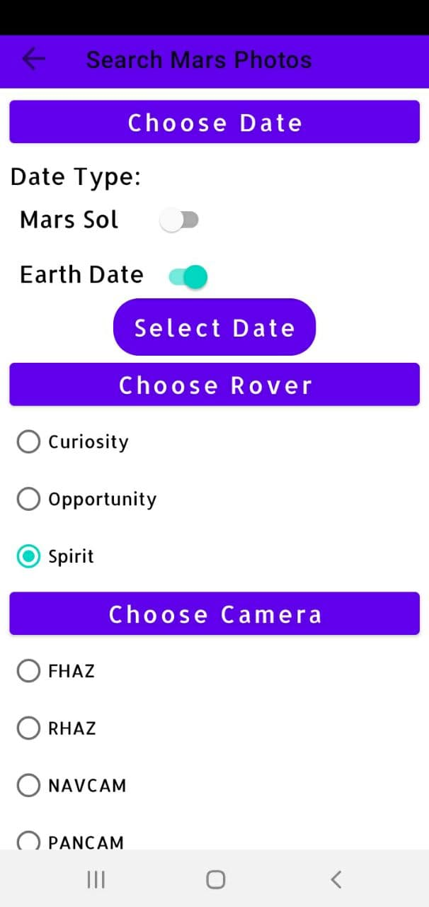

# NASA-Mars-Api-Service
This app can show you some Mars photos and random Space photos from official NASA API.

If you want to see some code, go [here](https://github.com/Ferum-bot/NASA-Mars-Api-Service/tree/main/app/src/main/java/com/example/nasa_mars_api_service).

If you want to see layout files, go [here](https://github.com/Ferum-bot/NASA-Mars-Api-Service/tree/main/app/src/main/res).

### What you can do:
* Search any Mars Photos from different rovers with some customization
* Save any Photos you like (in local cash) 
* See last Mars Photos in real time
* See most beautiful Space photos (according to NASA)
* See detailed description of each Mars Photo and Space Photo

### Using API: https://api.nasa.gov/

## Libraries used:
* [Retrofit](https://square.github.io/retrofit/)
* [Glide](https://github.com/bumptech/glide)
* [Room](https://developer.android.com/topic/libraries/architecture/room?gclid=Cj0KCQiAifz-BRDjARIsAEElyGLp2xffShidBLkKoGuTqHmEbAmWFn65cmFLwvo455NhfTrOgNZfi7IaAmvEEALw_wcB&gclsrc=aw.ds)
* [Dagger2](https://developer.android.com/training/dependency-injection/dagger-android)
* [PhotoView](https://github.com/chrisbanes/PhotoView)
* [Delegate Async Adapter](https://github.com/sockeqwe/AdapterDelegates)
* [OkHTTP](https://github.com/square/okhttp)

## Functionality used:
* Recycler View
* Cashing Images
* Parsing JSON
* MVVM
* Single Activity
* Database(SQL)
* Google Navigation compoment
* Data Binding
* LiveData
* Dependency injection (IoF)
* Delegate Adapter
* OkHttp logging-interceptor

## Some screenshots:

## Use case:

## How to install:
### First option:
Clone repository and run project in Android Studio.
### Second option:
Download apk file [here](https://drive.google.com/file/d/1hobF5UOsXF0DW9c6dGRuUUz24JM8-W03/view?usp=sharing).

## License:

https://github.com/Ferum-bot/UselessAndroidApps/blob/main/LICENSE

